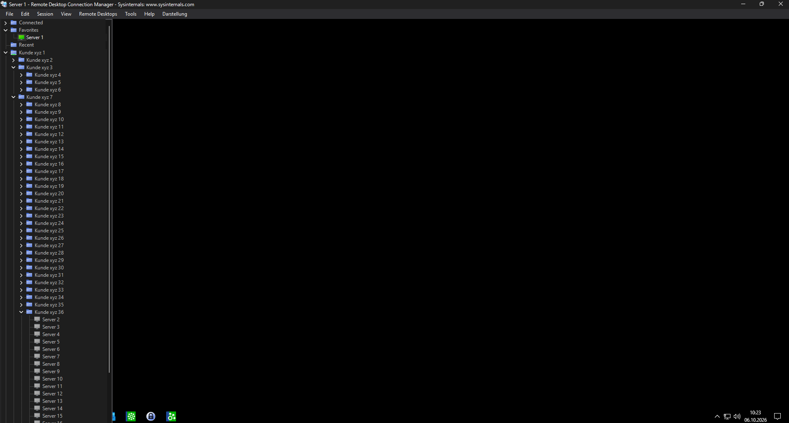
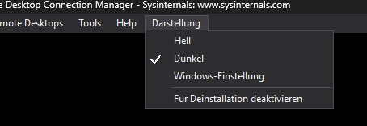

# RDCMan Dark Theme

Ein separates Dark-Mode-Plugin für Microsoft Sysinternals **Remote Desktop Connection Manager (RDCMan)**. Die Original-EXE bleibt unverändert und behält ihre Signatur.

**Hell · Dunkel · Windows-Einstellung** – direkt im Menü **Darstellung** umschalten. Die Windows-Einstellung folgt der Farbeinstellung für Apps.



*Vom Anwender bereitgestellter RDCMan-Screenshot, für die Veröffentlichung durch gezieltes Ersetzen der Beschriftungen anonymisiert: Ordner- und Servernamen wurden durch Beispielnamen ersetzt; persönliche Namen und die IP-Adresse wurden entfernt.*



## Installation

1. Eine originale RDCMan **3.12** oder **3.21** verwenden. [Offizieller Microsoft-Download](https://learn.microsoft.com/en-us/sysinternals/downloads/rdcman).
2. [Plugin.RDCManTheme.dll herunterladen](dist/Plugin.RDCManTheme.dll?raw=true) und direkt neben `RDCMan.exe` ablegen.
3. RDCMan starten und im Menü **Darstellung** den gewünschten Modus wählen.

Beim ersten Start ist Dunkel ausgewählt. Die Auswahl wird über RDCMans vorhandene globale Plugin-Einstellungen gespeichert. Für weitere Rechner EXE und Plugin-DLL gemeinsam kopieren. Keine zusätzliche Theme-DLL und kein zusätzlicher Runtime-Installer sind nötig.

Die Plugin-DLL ist unsigniert. SHA-256 der ausgelieferten v0.1.0-DLL:

```text
5D6411F8F92481C98B904D2F6FC9B5CDF3F1CD2620E296F07E54C4C07B69B90F
```

## Funktionsumfang

- Hauptfenster, Serverbaum, Menüleiste, Kontextmenüs und dynamische Untermenüs.
- Eigene Dialoge und Einstellungen, Tabs, Eingabefelder, Buttons, Gruppenrahmen und Listenköpfe.
- Erfassung neuer Controls und Fenster sowie Ausgleich von Fokus-Farbwechseln.
- Wiederherstellung der ursprünglichen Farben und Zeichenstile beim Wechsel zu Hell.
- RDP-/AxHost-Controls und ihre Unterbäume sind ausgeschlossen.

Palette: Hintergrund `#1E1E1E`, Panels `#252526`, Menüs `#2D2D30`, Text `#F1F1F1`, inaktiver Text `#BEBEBE`.

## Kompatibilität und Prüfstand

| Version | Prüfung |
|---|---|
| 3.12 / .NET 8 | Plugin-Erkennung und isolierte Theme-Tests erfolgreich; vom Anwender in RDCMan verwendet |
| 3.21 / .NET 10 | Dieselbe DLL: identische verwendete Plugin-Verträge und isolierte Theme-Tests erfolgreich; Start in echter RDCMan-Instanz vom Anwender bestätigt |

Der Testhost prüft MEF-Erkennung, Plugin-Lifecycle, mehrfaches Umschalten, Wiederherstellung der Darstellung, neue Fenster/Controls, dynamische Menüs, AxHost-Ausschluss, Plugin-XML sowie simulierte Änderungen der Windows-Farbeinstellung. Echte RDP-Verbindungen und `.rdg`-Roundtrips wurden nicht im Testhost geprüft. Das Plugin behebt keine Verbindungsprobleme von RDCMan.

Native Windows-Dateiauswahl, System-MessageBoxen, manche Systemflächen und der Tray-Kontext sind nicht vollständig dunkel bestätigt. Titelleisten hängen von Windows-Version und Desktop-Stil ab. Neue Dialoge können kurz einen hellen ersten Frame zeigen. [Weitere Prüfinformationen](docs/testing.md).

## Aus dem Quellcode bauen

Voraussetzungen: Windows, **PowerShell 7** und eine originale RDCMan-EXE. Kein SDK oder Python ist für das Build-Skript erforderlich.

```powershell
pwsh -File ./tools/Build.ps1 -RdcManExe "C:\Tools\RDCMan-3.12\RDCMan.exe"
```

Das Skript liest das .NET-Bundle statisch, extrahiert Build-Referenzen nach `build/refs` und kompiliert mit dem in PowerShell enthaltenen Roslyn-Compiler. Ergebnis: `build/Plugin.RDCManTheme.dll`. Die EXE wird nicht gestartet oder geändert. Für eine DLL, die beide geprüften Versionen abdeckt, gegen **3.12** bauen; ein Build gegen 3.21 richtet sich an dessen .NET-10-Laufzeit.

```powershell
pwsh -File ./tools/Build.ps1 -RdcManExe "C:\Tools\RDCMan-3.12\RDCMan.exe" -Test
```

`-Test` baut und startet ausschließlich eigene Testfenster außerhalb des sichtbaren Desktops. Es führt nicht RDCMan Main oder Verbindungscode aus. Voraussetzung zum Ausführen des Tests ist zusätzlich eine installierte WindowsDesktop-.NET-Laufzeit passend zur gewählten Version. Ergebnis: `build/plugin-test-result.txt` und Testbilder.

## Entfernen

Im Menü Darstellung **Für Deinstallation deaktivieren** wählen, RDCMan regulär schließen und danach die Plugin-DLL entfernen. So wird beim normalen Speichern/Beenden kein Plugin-Eintrag mehr gespeichert, der später eine Warnung über ein fehlendes Plugin auslösen könnte.

## Entwicklung

`src/Plugin.cs` enthält die MEF-/RDCMan-Integration, `src/Theme.cs` die reversible Darstellung und `tests/PluginTest.cs` den isolierten Testhost. Änderungen bitte anhand beider Theme-Modi und der Wiederherstellung testen. Bei Fehlerberichten RDCMan-/Windows-Version, gewählten Modus und betroffenen Dialog nennen; Screenshots vorher von Servernamen oder Zugangsdaten bereinigen.

## Lizenz

Dieses eigenständige Plugin steht unter der [MIT-Lizenz](LICENSE). Microsoft RDCMan und Microsofts Bibliotheken sind nicht Bestandteil dieser Lizenz und werden hier nicht mitgeliefert. Dieses Projekt ist unabhängig von Microsoft.
